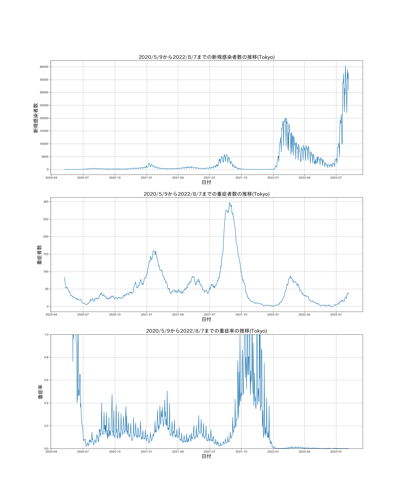

# 概要

[厚生労働省が公開している新型コロナウィルス関連のオープンデータ](https://covid19.mhlw.go.jp/) を用いて、各都道府県（全国含む）の感染者数・重症者数・重症率のグラフを描くプログラム

# 開発環境

- OS: Ubuntu / Windows10 (Windows Subsystem for Linux)
- 言語: Python 3.8.4

# 必要ライブラリ

- matplotlib == 3.3.2
- japanize_matplotlib == 1.1.3
- pandas == 1.1.3
- tqdm == 4.50.2

以下コマンドでインストール

```sh
pip install -r requirements.txt
```

# 実行方法

```
python3 covid.py
```

オプション

```
  --output      出力先のディレクトリ
  --error_num   新規感染者数が0だった時の重症率の値
  --start_date  描画を開始する日付
  --full_range  重症率のグラフを全範囲で（0~1.0の範囲に限定せず）描画する
```

デフォルトでは、`--output`は`./images/`、`error_num`は 100、`start_date`は 2020/5/9 です

# 詳細

- 重症率の定義

「重症率」とは"厳密な"重症率ではありません．

`(重症率) = (当日の重症者数）/（新規感染者数）`

という計算法を用いています．ただし、新規感染者数が 0 だった場合は、

- モチベーション

新型コロナウイルスの感染状況について、従来は新規感染者数による判断が一般的です。
一方で、「重症者数や重症率を判断の基準とすべきだ」という人もある程度存在します。

特に「重症率」については、意外とテレビなどで取り上げられることもないと思うので、
これを計算するプログラムを書き、候補の１つとなればと思います。

※コロナ感染状況について、重症率を判断の基準とすべきと主張する物ではありません。

# 最新結果

とりあえず、日本全国と東京都の最新結果を貼っておきます（その他の主要都市分は`images`においておきます)

- 東京都
  
- 日本全国
  
