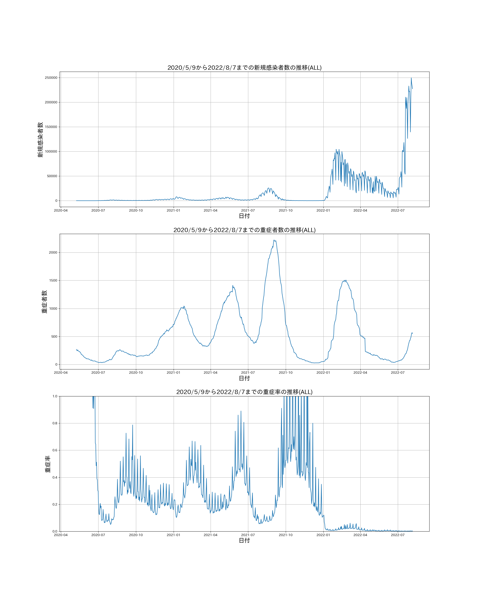

# 概要
[厚生労働省が公開している新型コロナウィルス関連のオープンデータ](https://covid19.mhlw.go.jp/) を用いて，各都道府県（全国含む）の感染者数・重症者数・重症率のグラフを描くプログラム
# 開発環境
- OS: Ubuntu / Windows10 (Windows Subsystem for Linux)
- 言語: Python 3.8.4
Windows10・Ubuntu(WSL)
# 必要ライブラリ
- matplotlib == 3.3.2
- japanize_matplotlib == 1.1.3
- pandas == 1.1.3
- tqdm == 4.50.2

以下コマンドでインストール
```bash
pip install -r requirements.txt
```

# 実行方法
- Windows
```
python covid.py
```
- WSL
```
python3 covid.py
```
オプション
```
  --output      出力先のディレクトリ
  --error_num   新規感染者数が0だった時の重症率の値
  --start_date  描画を開始する日付
```
デフォルトでは，`--output`は`./images/`，`error_num`は100，`start_date`は2020/5/9です
# 詳細
- 重症率の定義

「重症率」とは"厳密な"重症率ではありません．

`(重症率) = (当日の重症者数）/（新規感染者数）`

という計算法を用いています．ただし，新規感染者数が0だった場合は100とします．（いくつでもいいですが）

実際には1を超える可能性もある値です

- モチベーション

新型コロナウイルスの感染状況について，従来は新規感染者数による判断が一般的ですが，
一方で，「重症者数や死者数で判断する派」や「新規感染者に対する重症者数等の割合で判断する派」も多数存在します

しかし，特に「重症率」のグラフはあまりメディアでも取り上げられてない気がするので，
各都道府県ごとにグラフを出力するプログラムを提供します．

また，（あくまで予定ですが）週に一度こちらの方でプロットしコミットするつもりです．

# 最新結果
とりあえず，日本全国と東京都の最新結果を貼っておきます

- 東京都

- 日本全国



